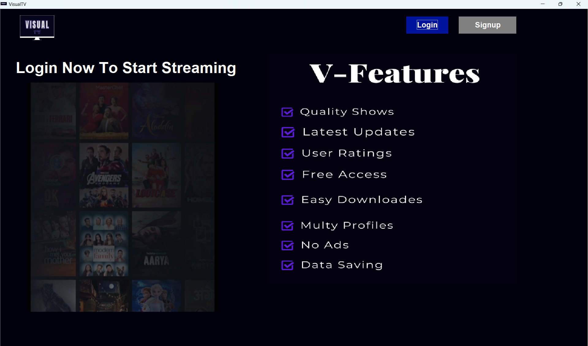
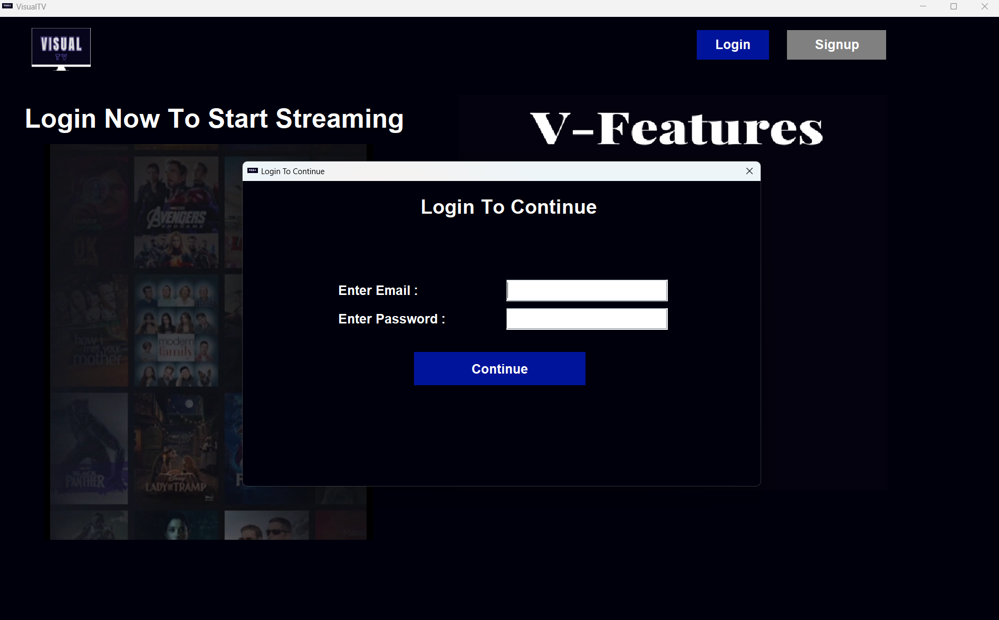
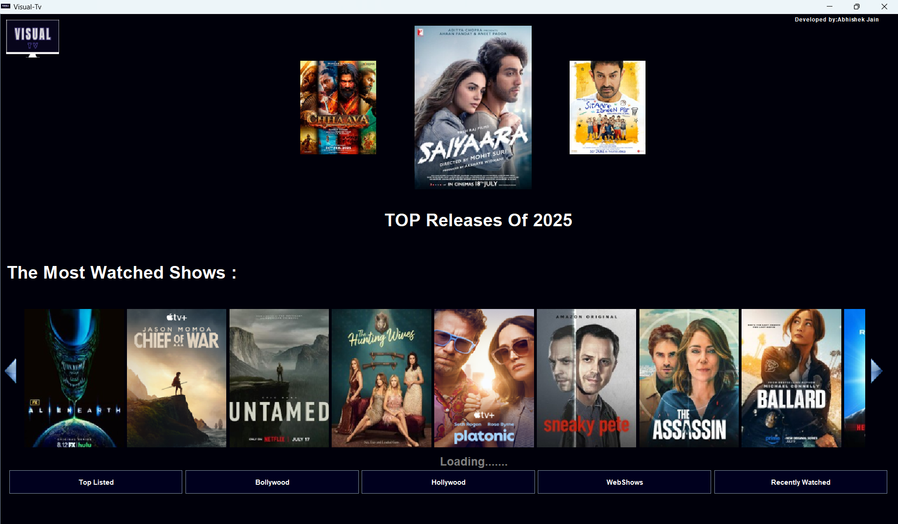
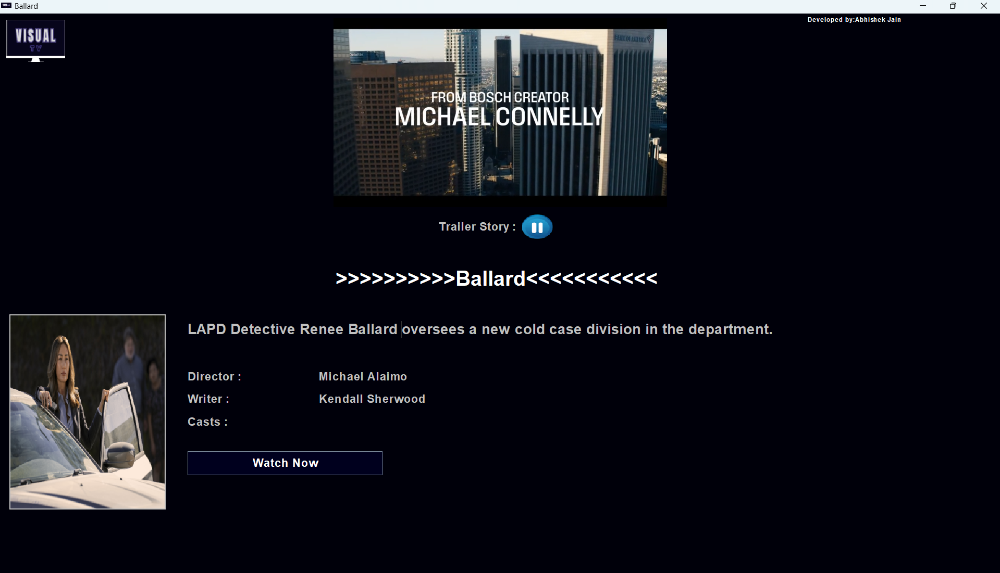
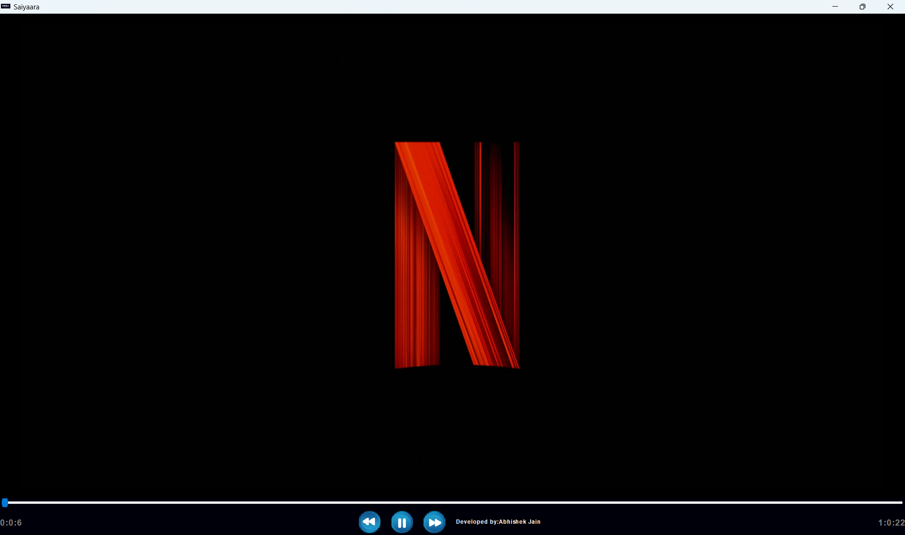
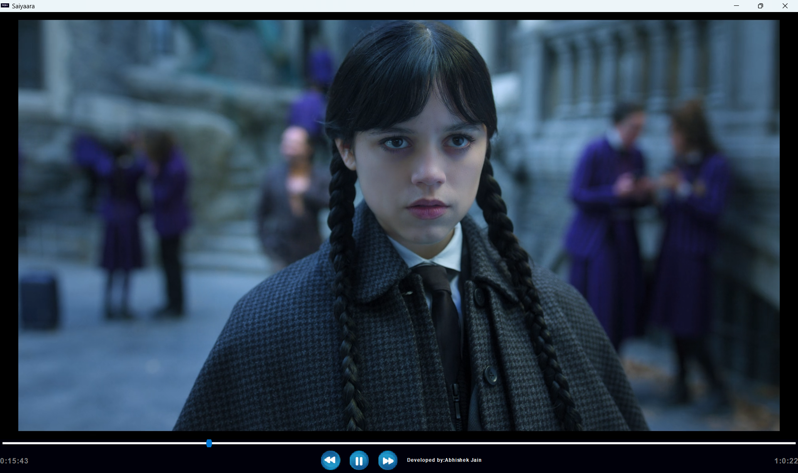
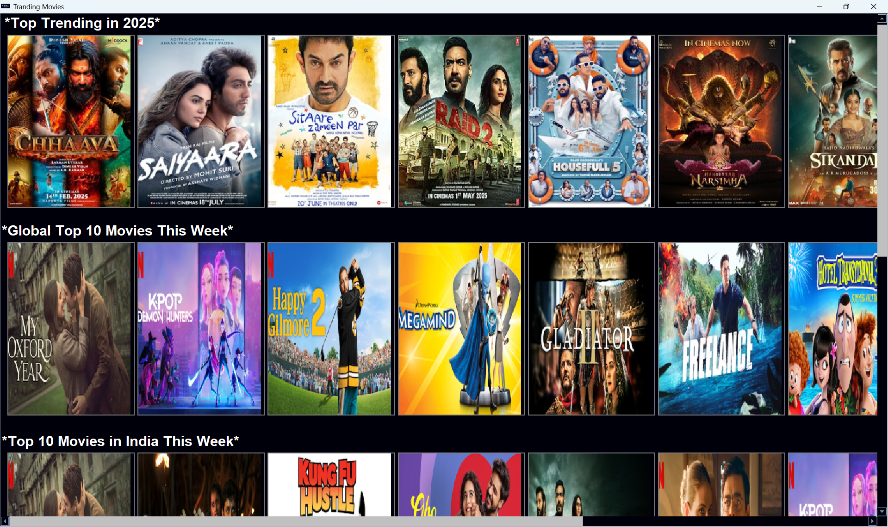
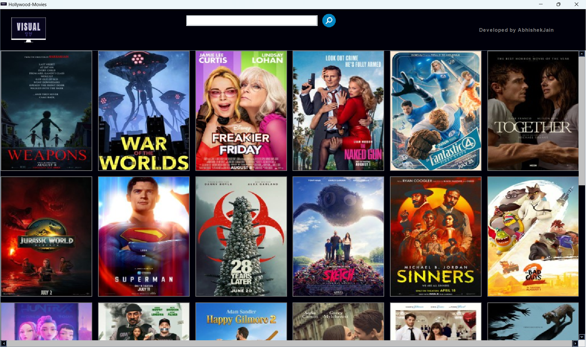
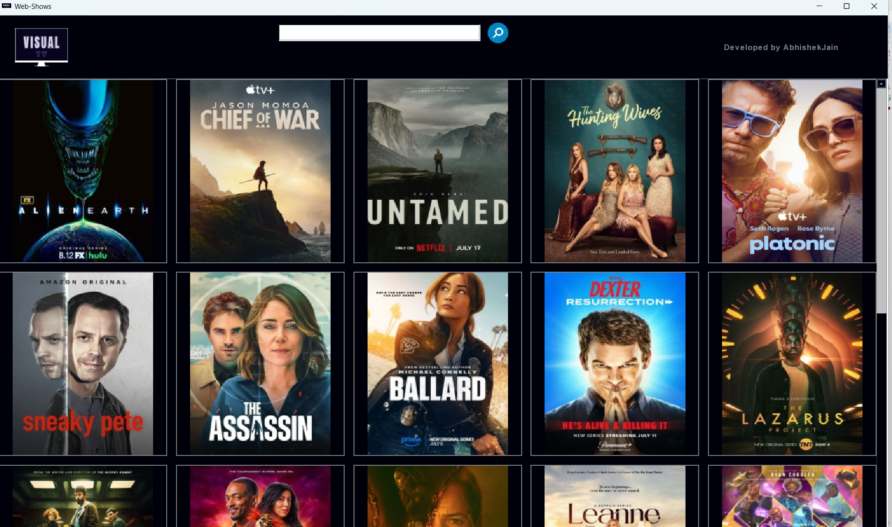

# 📺 Visual TV — Java-Based OTT Streaming Platform

**Visual TV** is a powerful desktop OTT application built in Java using JavaFX, Swing, Selenium, and VLCJ. It offers real-time access to trending movies, web series, and trailers with secure user authentication via SMTP. Designed for smooth playback, smart scraping, and personalized viewing.

---

## 🎬 Key Features

- 🔐 **User Authentication**
  - Email-based login with OTP verification via SMTP
  - Secure credential handling and session management

- 🌐 **Real-Time Scraping**
  - Uses Selenium to fetch trending content from IMDb
  - Scrapes movie ratings, cast, descriptions, and trailers

- 🎥 **Custom Media Player**
  - Built with VLCJ API
  - Supports resume, pause, forward, rewind, and progress bar
  - Separate players for movies and web series

- 📊 **Watch History & Resume**
  - Tracks recently watched content
  - Resumes playback from last watched timestamp using MySQL

- 🔍 **Search & Filter**
  - Search bar in all sections (Trending, Bollywood, Hollywood, Web Shows)
  - Filter by language, quality, and episode

- 🧾 **Content Sections**
  - Top Trending
  - Bollywood
  - Hollywood
  - Web Shows
  - Watch History
  - Favorites

---

## 🖼️ Visual Preview

### 🔐 Login Page

  
*Secure login with email and OTP verification.*

---

### 📝 Login Form

  
*Enter email and password to authenticate.*

---

### 🏠 Home Window

  
*Browse trending content and navigate sections.*

---

### 🎞️ Trailer Window

  
*Watch trailers in a custom VLCJ-powered player.*

---

### 🎬 Movie Window

  
*Stream movies with full media controls.*

---

  
*Alternate view of movie playback.*

---

### 🔥 Top Trending

  
*Explore the most popular shows and films.*

---

### 🎥 Hollywood Section

  
*Browse trending Hollywood movies.*

---

### 📺 Web Shows Section

  
*Stream web series from global platforms.*

---

## 🛠️ Tech Stack

| Layer       | Technology             |
|-------------|-------------------------|
| UI          | JavaFX, Swing           |
| Scraping    | Selenium WebDriver , Jsoup      |
| Media       | VLCJ (Java VLC API)     |
| Auth        | SMTP (JavaMail API)     |
| Database    | MySQL + MongoDB         |
| Automation  | Web Control + Browser Automation |

---

## 🚀 Getting Started

To run locally:

```bash
# Clone the repository
git clone https://github.com/abhi041540/VisualTV_JavaApp.git
cd VisualTV_JavaApp

# Compile and run
javac Main.java
java Main
